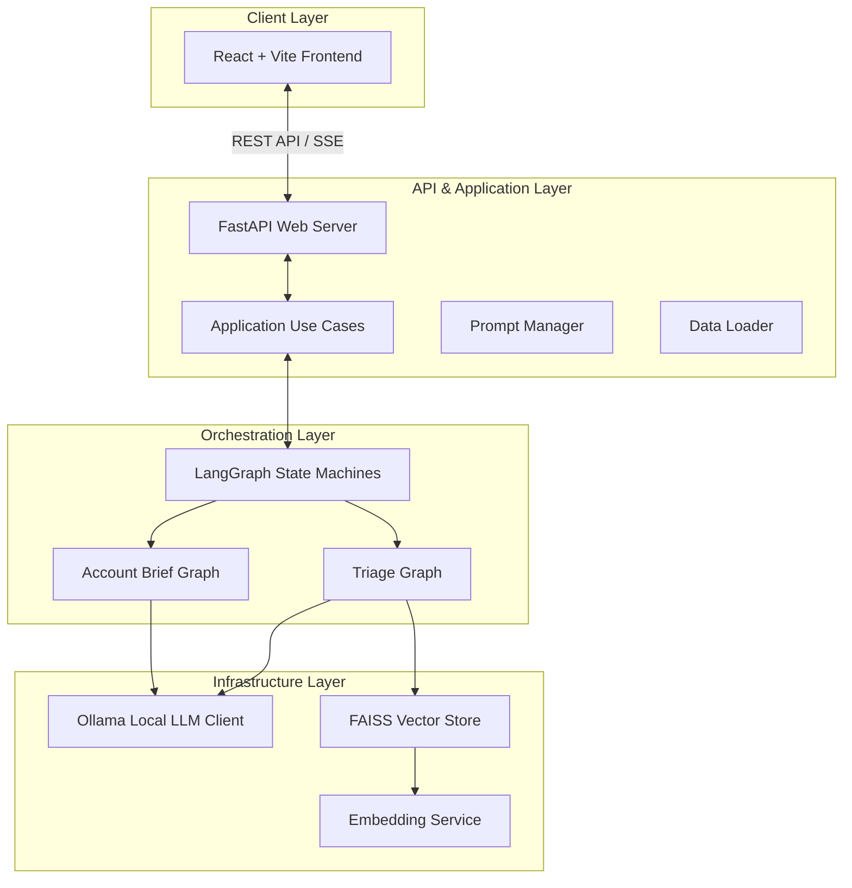
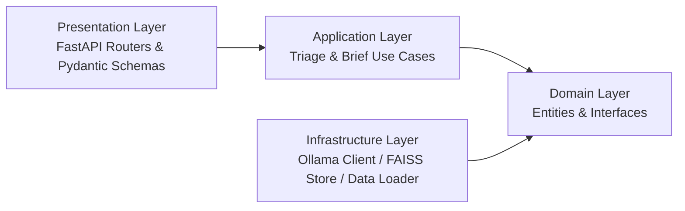
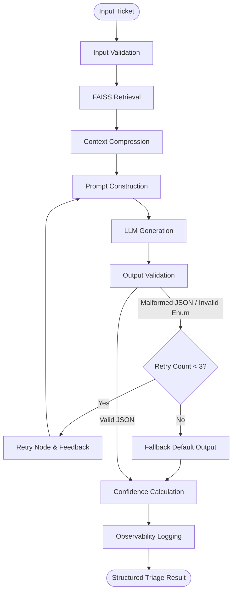
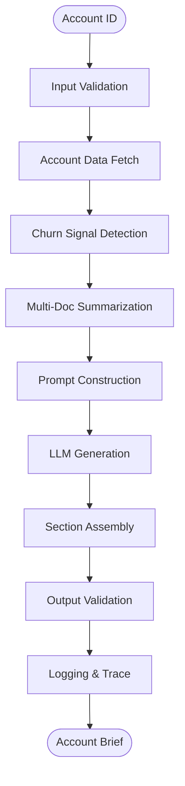

# TAM AI Platform

> **US Delivery Internship — Technical Task Round**  
> Production-grade AI for Technical Support & TAM Teams

[](https://python.org)
[](https://fastapi.tiangolo.com)
[](https://langchain-ai.github.io/langgraph)
[](https://ollama.ai)

## 📊 Platform Overview

The **TAM AI Platform** is an enterprise-grade intelligent support system that combines AI-powered ticket triage with account health analysis. Built with LangGraph orchestration, FAISS vector retrieval, and local Ollama models, it delivers production-ready workflows for Technical Support and TAM teams.

### Completed Deliverables
✅ **Task 1: Intelligent Ticket Triage** — LangGraph-based triage with RAG, routing, confidence scoring, and retry/fallback handling  
✅ **Task 2: Account Health Briefs** — Multi-document account summarization with churn-risk detection and TAM recommendations  
✅ **Task 3: Evaluation Harness** — Automated evaluation suite with success rate, quality score, latency, confidence, and report generation  
✅ **Bonus Task: System Dashboard** — Live monitoring dashboard for system resources, Ollama model status, FAISS health, and runtime metrics  

### Key Features
✅ **Intelligent Ticket Triage** — Automatic ticket classification with P1-P4 urgency routing  
✅ **Account Health Briefs** — Multi-document summarization for customer insights  
✅ **Evaluation Harness** — Automated quality checks for triage and account brief outputs  
✅ **Local Execution** — 100% local inference via Ollama (no external APIs)  
✅ **Production Reliability** — Retry loops, fallback handlers, and schema validation  
✅ **Bonus System Dashboard** — Live monitoring dashboard with metrics and model status  
✅ **Knowledge Base RAG** — FAISS-powered semantic search over product documentation  

---

## � Platform Interface & Visuals

### Task 1: Intelligent Ticket Triage Interface

*Main triage interface showing ticket intake, P1 urgency routing, and real-time analysis with confidence scores*


*Triage output displaying detected product, issue category, routing team, and knowledge base matches with RAG confidence scoring*

### Task 2: Account Health Briefs

*Account health summarization interface using multi-document analysis to detect churn signals and escalation points*


*Generated brief showing executive summary, open risks, flagged issues, and recommended talking points for TAM engagement*

### Task 3: Evaluation Harness & Quality Assurance

*Completed Task 3 evaluation harness showing automated test success rates, quality scores, latency metrics, confidence scoring, and detailed test case results with failure analysis*

### Bonus Task: System Dashboard & Live Metrics

*Bonus system dashboard displaying CPU/RAM/storage utilization, Ollama model status, FAISS index health, live service checks, and resource allocation*

---

The platform consists of a React/Vite SPA frontend, a FastAPI backend server serving REST and SSE endpoints, a FAISS vector database for product knowledge retrieval, and local Ollama model engines orchestrated via LangGraph.

### Overall System Flow


### Domain-Driven Design (DDD) Layers


---

## ⚡ LangGraph AI Pipelines

### Task 1: Intelligent Ticket Triage Flow

The triage workflow automates ticket classification through a multi-step LangGraph state machine. Raw tickets undergo validation, context retrieval, and LLM-powered generation with built-in failure recovery.

**Pipeline Steps:**
1. **Input Validation** — Enforce schema compliance on incoming ticket data
2. **Knowledge Base Retrieval** — FAISS similarity search to find relevant KB articles
3. **Context Compression** — Summarize top-K chunks to fit within LLM context window
4. **Prompt Construction** — Template-based prompt with few-shot examples and KB context
5. **LLM Generation** — Stream responses from Ollama with structured output
6. **Output Validation** — JSON schema validation and enum constraint checking
7. **Confidence Calculation** — Heuristic scoring based on validation success and model certainty
8. **Retry Loop** — On validation failure, re-prompt with error feedback (max 3 retries)



**Output Schema:**
```json
{
  "ticket_id": "TKT-12345",
  "detected_product": "DataBridge Pro",
  "category": "Bug",
  "urgency": "P1",
  "confidence": 0.92,
  "reasoning": "Connection timeout error pattern matches known DataBridge Pro issue",
  "kb_matches": ["databridge-pro.md#connection-errors"],
  "routing_team": "Engineering Support"
}
```

### Task 2: Account Health Summarizer

The account brief pipeline performs multi-document analysis to synthesize customer health signals, churn indicators, and strategic recommendations.

**Pipeline Features:**
- Extracts recent tickets, escalation notes, and health metrics for a specific account
- Detects churn signals (cancellation keywords, frustration indicators)
- Generates 3-section briefs: Executive Summary → Open Risks → Recommended Actions
- Includes determinism guard (temp=0) to ensure consistent outputs across runs



---

## 🚀 Quick Setup & Installation

### Prerequisites
1. **Ollama**: Download and install [Ollama](https://ollama.ai/download).
2. **Pull Models**: Run the following commands to download the classification and embedding models:
   ```bash
   ollama pull qwen2.5
   ollama pull nomic-embed-text
   ```
3. **Start Ollama**: Make sure Ollama is running (`ollama serve` or run the Ollama desktop app).
4. **System Requirements**: 
   - Minimum 8GB RAM (16GB+ recommended)
   - 30GB free disk space for models
   - Python 3.10+
   - Node.js 16+ (for frontend)

### Installation
From the project root directory:
```bash
# 1. Install Python dependencies
pip install -r requirements.txt

# 2. Configure environment variables
cp .env.example .env
# Edit .env with your settings (LLM model names, API ports, etc.)

# 3. Build FAISS vector index from knowledge base
python scripts/build_index.py
# This ingests all markdown files from knowledge-base/ directory

# 4. Install frontend dependencies (optional, only if running dev mode)
cd frontend
npm install
cd ..
```

### Starting the Applications

#### Backend Server (FastAPI REST API)
```bash
# Set Python path
$env:PYTHONPATH = "C:\Users\hp\OneDrive\Desktop\TAM"

# Start uvicorn server on port 8050
python -m uvicorn src.presentation.main:app --host 0.0.0.0 --port 8050 --reload
```
- **Swagger UI**: http://localhost:8050/docs
- **API Base**: http://localhost:8050/api/v1

#### Frontend Development Server (React + Vite)
```bash
cd frontend
npm run dev
```
- **Local Access**: http://localhost:5173
- **Proxy to Backend**: `/api` routes forward to http://localhost:8050/api

#### Production Build & Serving
```bash
# Build optimized frontend bundle
cd frontend
npm run build

# FastAPI automatically serves from frontend/dist
# Access at http://localhost:8050 (no need for separate frontend server)
```

---

## 🗄️ Database & Schema Reference

### tickets.json Schema
| Field | Type | Description / Key Values |
|---|---|---|
| `ticket_id` | string | Unique ticket identifier |
| `product` | string | DataBridge Pro, CloudSync, AnalyticsHub, SecureVault, WorkflowEngine |
| `category` | enum | Bug, Feature Request, How-To, Performance, Billing, Integration, Onboarding, Data Loss |
| `urgency` | enum | P1 (critical ~5%), P2 (major ~20%), P3 (moderate ~45%), P4 (low ~30%) |
| `status` | enum | Open, In Progress, Pending Customer, Resolved, Closed |

### accounts.json Schema
| Field | Type | Description / Key Values |
|---|---|---|
| `account_id` | string | Unique account identifier |
| `health_status`| enum | Healthy, At Risk, Churning, New |
| `usage_trend` | enum | Increasing, Stable, Declining, Inactive |
| `escalation_notes`| array | Churn signals containing competitor keywords, cancels, or frustrations |

---

## � Project Structure

```
TAM/
├── src/                          # Python backend source code
│   ├── presentation/             # FastAPI routers & request handlers
│   │   └── main.py              # Application entrypoint
│   ├── application/             # Business logic layer
│   │   ├── triage_usecase.py    # Triage orchestration
│   │   └── account_brief_usecase.py  # Brief generation
│   ├── ai/                      # LangGraph pipelines & nodes
│   │   ├── graphs/              # State machine definitions
│   │   ├── nodes/               # Individual pipeline steps
│   │   └── rules.py             # Business rules & validation
│   ├── infrastructure/          # External integrations
│   │   ├── llm_client.py        # Ollama connection
│   │   ├── vector_store.py      # FAISS wrapper
│   │   └── embedding_service.py # Sentence embeddings
│   └── observability/           # Logging & tracing
│
├── frontend/                     # React + Vite UI
│   ├── src/components/          # React components (Tabs, Forms)
│   └── src/App.jsx              # Main app shell
│
├── knowledge-base/              # Product documentation
│   ├── products/                # Product guides
│   ├── troubleshooting/         # Error solutions
│   └── onboarding/              # Setup guides
│
├── evaluation/                  # Automated test suite
│   ├── run_eval.py             # Evaluation orchestrator
│   ├── framework/               # Test metric classes
│   └── test_cases/              # Scenario files
│
├── data/                        # Sample datasets
│   ├── tickets.json             # Test ticket corpus
│   └── accounts.json            # Test account profiles
│
├── vector_store/                # FAISS index artifacts
│   └── faiss_index/
│       └── index.faiss          # Serialized vector database
│
└── scripts/                     # Utility scripts
    └── build_index.py          # Index builder

```

---

## 📊 Data Schemas

### Ticket Classification
```json
{
  "ticket_id": "TKT-3847",
  "account_id": "ACC-3847",
  "subject": "DataBridge pipeline stopped - ERR_CONNECTION_TIMEOUT",
  "body": "Our DataBridge Pro Connectors pipeline has been failing since this morning. Error: ERR_CONNECTION_TIMEOUT after 30s. This is impacting 47 users in Engineering. We have tried restarting but the issue persists.",
  "product": "DataBridge Pro",
  "category": "Bug",
  "urgency": "P1",
  "status": "Open",
  "plan_tier": "Enterprise (2h SLA)"
}
```

### Account Health Profile
```json
{
  "account_id": "ACC-3336",
  "account_name": "TechCorp Inc",
  "health_status": "At Risk",
  "usage_trend": "Declining",
  "arr_usd": 250000,
  "p1_tickets_last_30d": 3,
  "escalation_notes": ["Churn signals", "Performance complaints", "Critical incident history"],
  "renewal_date": "2026-12-15"
}
```

### Account Brief Output
```json
{
  "account_id": "ACC-3336",
  "generated_at": "2026-08-08T10:30:00Z",
  "brief": {
    "executive_summary": "The account's usage trend is currently inactive with a high number of open tickets (7), indicating potential issues that have not been resolved in recent weeks.",
    "open_risks": [
      "Health Status is At Risk",
      "Usage Trend is Inactive",
      "3 consecutive P1 incidents in the last 30 days"
    ],
    "recommended_actions": "The TAM should prioritize addressing the performance degradation and billing concerns. Given the recent escalation note about P1 tickets, it is crucial to ensure that all team members are informed about potential maintenance windows."
  }
}
```

---

## 🧪 Evaluation Harness (Task 3)

The platform includes an automated evaluation framework to validate triage and brief generation quality:

```bash
python evaluation/run_eval.py
```

**Metrics:**
- **Success Rate**: % of tests with correct output schema
- **Quality Score**: Heuristic scoring for reasoning relevance (0.0–1.0)
- **Latency**: End-to-end pipeline execution time
- **Confidence**: Average model confidence score across test set

**Test Cases:**
- Task 1 (Triage): 5 test scenarios covering P1–P4 urgencies, product variety, and edge cases
- Task 2 (Brief): 5 test scenarios for healthy, at-risk, and churning accounts

**Output Reports:**
- `eval_report.json` — Structured test results
- `eval_report.md` — Human-readable summary with pass/fail details

---

## 🔒 Security & Best Practices

### Data Privacy
✅ **Local Inference Only** — All LLM calls run on-device via Ollama (no API calls)  
✅ **Secret Management** — Environment variables for sensitive config (never hardcoded)  
✅ **Input Sanitization** — Validation at presentation layer prevents injection attacks  
✅ **PII Masking** — Email, phone, and name fields masked in logs  

### Production Reliability
✅ **Retry Loops** — Max 3 retries with exponential backoff on LLM generation failure  
✅ **Fallback Handlers** — Graceful degradation when models unavailable  
✅ **Schema Validation** — JSON schema + enum enforcement before returning results  
✅ **Observability** — Structured logging with request tracing and performance metrics  

### Deployment
✅ **Docker-Ready** — Containerizable backend and frontend  
✅ **Horizontal Scaling** — Stateless FastAPI allows multi-instance deployment  
✅ **Health Checks** — `/health` endpoint monitors Ollama, FAISS, and system resources  

---

## 🚀 Usage Examples

### Triage a Ticket (REST)
```bash
curl -X POST http://localhost:8050/api/v1/triage \
  -H "Content-Type: application/json" \
  -d '{
    "ticket_id": "TKT-001",
    "account_id": "ACC-3847",
    "subject": "DataBridge pipeline stopped",
    "body": "Pipeline failing with connection timeout error",
    "plan_tier": "Enterprise (2h SLA)"
  }'
```

**Response:**
```json
{
  "ticket_id": "TKT-001",
  "detected_product": "DataBridge Pro",
  "category": "Bug",
  "urgency": "P1",
  "confidence": 0.95,
  "routing_team": "Senior Engineering Support",
  "reasoning": "Connection timeout + production impact = P1 bug",
  "kb_matches": [
    {
      "title": "DataBridge Pro — Product Reference",
      "error_codes": ["ERR_CONNECTION_TIMEOUT"],
      "relevance": 0.89
    }
  ]
}
```

### Generate Account Brief
```bash
curl -X GET http://localhost:8050/api/v1/account/ACC-3336/brief
```

**Response:**
```json
{
  "account_id": "ACC-3336",
  "account_name": "TechCorp Inc",
  "brief": {
    "executive_summary": "Account at risk with recent escalation...",
    "open_risks": ["Performance issues", "High P1 ticket count"],
    "recommended_actions": "Prioritize customer outreach and issue resolution"
  },
  "generated_at": "2026-08-08T10:45:00Z"
}
```

---

## 📖 Documentation

- **[DESIGN_NOTE.md](DESIGN_NOTE.md)** — Architectural decisions, failure modes, and 10x scale roadmap
- **[PROJECT_BLUEPRINT.md](PROJECT_BLUEPRINT.md)** — Detailed technical blueprint and system components
- **[DATA_SCHEMA.md](DATA_SCHEMA.md)** — Complete data model reference
- **[eval_report.md](eval_report.md)** — Evaluation results and quality metrics

---

## 🤝 Contributing

To extend the platform:

1. **Add New Nodes** — Create new node functions in `src/ai/nodes/` following the existing pattern
2. **Extend Graphs** — Modify state machines in `src/ai/graphs/` to add new workflow steps
3. **Update KB** — Add markdown files to `knowledge-base/` and rebuild index: `python scripts/build_index.py`
4. **Add Tests** — Extend `evaluation/test_cases/` with new test scenarios

---

## 📄 License

Built for the **US Delivery Internship — Technical Task Round**
