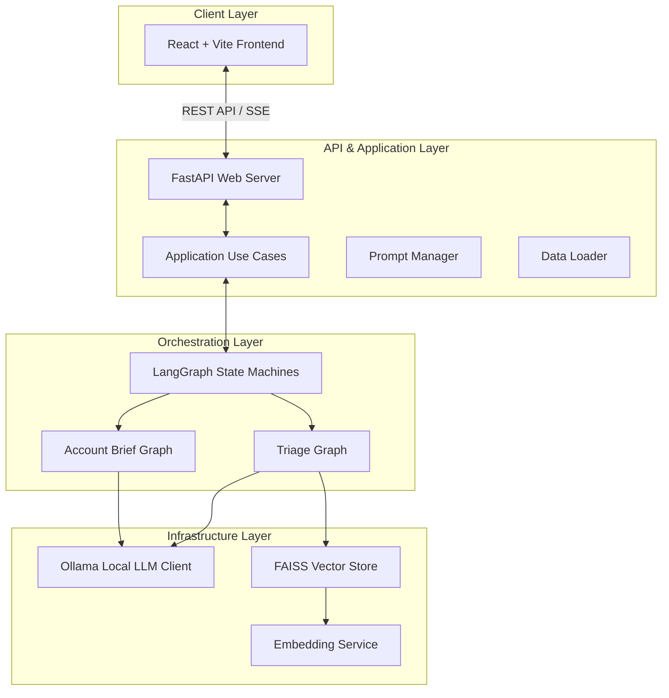
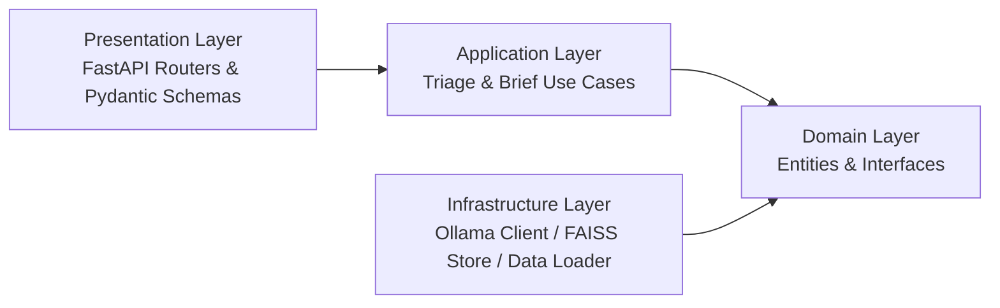
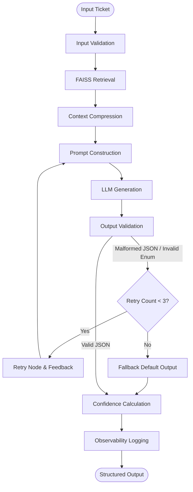

# TAM AI Platform

> **US Delivery Internship — Technical Task Round**  
> Production-grade AI for Technical Support & TAM Teams

[](https://python.org)
[](https://fastapi.tiangolo.com)
[](https://langchain-ai.github.io/langgraph)
[](https://ollama.ai)

---

## 🏗️ System Architecture

The platform consists of a React/Vite SPA frontend, a FastAPI backend server serving REST and SSE endpoints, a FAISS vector database for product knowledge retrieval, and local Ollama model engines orchestrated via LangGraph.

### Overall System Flow


### Domain-Driven Design (DDD) Layers


---

## ⚡ LangGraph AI Pipelines

### Task 1: Intelligent Ticket Triage Flow
The triage agent routes raw ticket payloads through a validation loop. If the LLM generates malformed outputs or invalid categories, it enters a retry loop with feedback.


---

## 🚀 Quick Setup & Installation

### Prerequisites
1. **Ollama**: Download and install [Ollama](https://ollama.ai/download).
2. **Pull Models**: Run the following commands to download the classification and embedding models:
   ```bash
   ollama pull qwen2.5
   ollama pull nomic-embed-text
   ```
3. **Start Ollama**: Make sure Ollama is running (`ollama serve` or run the Ollama desktop app).

### Installation
From the project root directory:
```bash
# 1. Install dependencies
pip install -r requirements.txt

# 2. Configure environment
cp .env.example .env

# 3. Build FAISS index (ingests local MD knowledge base files)
python scripts/build_index.py
```

### Starting the Applications

#### 1. Backend Server (FastAPI)
```bash
# Ensure project root is in PYTHONPATH
$env:PYTHONPATH = "C:\Users\hp\OneDrive\Desktop\TAM"

# Start the uvicorn API server
python -m uvicorn src.presentation.main:app --host 0.0.0.0 --port 8050
```
Open **http://localhost:8050/docs** for the Swagger interactive documentation.

#### 2. Frontend Development Server (React + Vite)
```bash
cd frontend
npm run dev
```
Starts Vite dev server on **http://localhost:5173** and proxies `/api` to the backend.

#### 3. Production Build
```bash
cd frontend
npm run build
```
FastAPI serves the built frontend from `frontend/dist` directly at **http://localhost:8050/**.

---

## 🗄️ Database & Schema Reference

### tickets.json Schema
| Field | Type | Description / Key Values |
|---|---|---|
| `ticket_id` | string | Unique ticket identifier |
| `product` | string | DataBridge Pro, CloudSync, AnalyticsHub, SecureVault, WorkflowEngine |
| `category` | enum | Bug, Feature Request, How-To, Performance, Billing, Integration, Onboarding, Data Loss |
| `urgency` | enum | P1 (critical ~5%), P2 (major ~20%), P3 (moderate ~45%), P4 (low ~30%) |
| `status` | enum | Open, In Progress, Pending Customer, Resolved, Closed |

### accounts.json Schema
| Field | Type | Description / Key Values |
|---|---|---|
| `account_id` | string | Unique account identifier |
| `health_status`| enum | Healthy, At Risk, Churning, New |
| `usage_trend` | enum | Increasing, Stable, Declining, Inactive |
| `escalation_notes`| array | Churn signals containing competitor keywords, cancels, or frustrations |

---

## 📡 API Endpoints

| Method | Path | Description |
|---|---|---|
| `GET` | `/` | Service info & Landing |
| `GET` | `/health` | Health check + index status |
| `GET` | `/docs` | Interactive Swagger UI |
| `POST` | `/api/v1/triage` | Structured JSON triage |
| `POST` | `/api/v1/triage/text` | Plain text triage |
| `POST` | `/api/v1/triage/stream` | Streaming SSE triage |
| `GET` | `/api/v1/account/{id}/brief` | Account health brief |
| `POST` | `/api/v1/index/rebuild` | Rebuild FAISS index |

---

## 📝 Design Note (Task 4 Summary)

For the complete architectural design note, refer to [DESIGN_NOTE.md](DESIGN_NOTE.md). It covers:
* **Production Failure Modes**: Schema-validation repair loops, KB Match hallucination containment, and model server outage fallbacks.
* **Latency vs. Quality**: Balancing retrieval context window size (`top_k=5` chunks) vs. CPU generation latency.
* **Data Security & PII**: Enforcing fully local execution via Ollama and FAISS.
* **10x Scale Roadmap**: Transitioning to asynchronous task brokers (Celery + Redis), GPU model server clusters, and distributed vector stores.

---

## 🧪 Evaluation Harness (Task 3)
Run the automated evaluation suite to generate validation reports:
```bash
python evaluation/run_eval.py
```
This writes reports to `eval_report.json` and `eval_report.md`.
